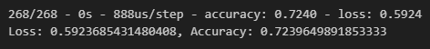
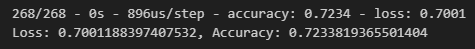

# deep-learning-challenge

## Code Sources
Code in block 3 in both Notebooks taken from StackOverflow: https://stackoverflow.com/questions/27241253/print-the-unique-values-in-every-column-in-a-pandas-dataframe  
lambda function in block 7 in both Notebooks taken from StackOverflow: https://stackoverflow.com/questions/22320356/pandas-get-values-from-column-that-appear-more-than-x-times

# Report: Predicting Successful Alphabet Soup Applicants Using a Neural Network Model

## Overview
This analysis aimed to create a tool for the nonprofit foundation Alphabet Soup that can assist with selecting applicants for funding with the highest chance of success in their ventures. We  created a neural network that analyzed several factors of more than 34,000 organizations that have previously received funding from Alphabet Soup--such as their affiliated industry, government classification, and funding amount requested.

## Data Preprocessing
* Whether or not the money was used effectively was the target for our model.
* The affiliated industry, government organization classification, funding use case, organization type, active status, income classification, special considerations, and funding amount requested were the features for our model.
* The EIN number and organization name were neither features nor targets, so they were removed from the input data.

## Compiling, Training, and Evaluating the Model
* In the initial neural network model, we used an input layer with 44 inputs and 80 neurons, 1 hidden layer with 30 neurons, and an output layer returning either 0 or 1. It resulted in 72.4% accuracy as seen below.

* Unfortunately, we were unable to achieve the target performance of 75%.
* In an attempt to increase model performance, we increased the number of neurons in the hidden layers from 30 to 50, added 2 additional hidden layers, binned the "funding request amount" column into 7 bins, and increased the cutoff value for outliers for the "government classification" column. Despite these improvements, the model only produced an accuracy of 72.34% as shown below, which is about the same as the initial model.

## Summary
Overall, the neural network moidel we used achieved an accuracy of about 72.35%, which was unfortunately lower than we were hoping for. A supervised learning model might work better for this classification problem, such as KMeans, decision tree, or a random forest model, because the end result of this data is to predict between two options--an applicant will be successful or they will not be successful, which these supervised models are very effective at.
